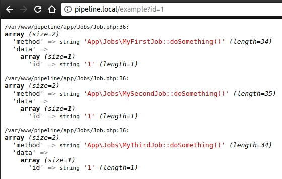

## Example of Laravel queues managing

Look into [app/Jobs](app/Jobs) path. There are:

- [app/Jobs/Job.php](app/Jobs/Job.php) - base class for jobs.
- [app/Jobs/Pipeline/PipelineAbstract.php](app/Jobs/Pipeline/PipelineAbstract.php) - base class for pipelines.
- [app/Jobs/Pipeline/ProcessDataPipeline.php](app/Jobs/Pipeline/ProcessDataPipeline.php) - Example of concrete pipeline.

Example of output:

